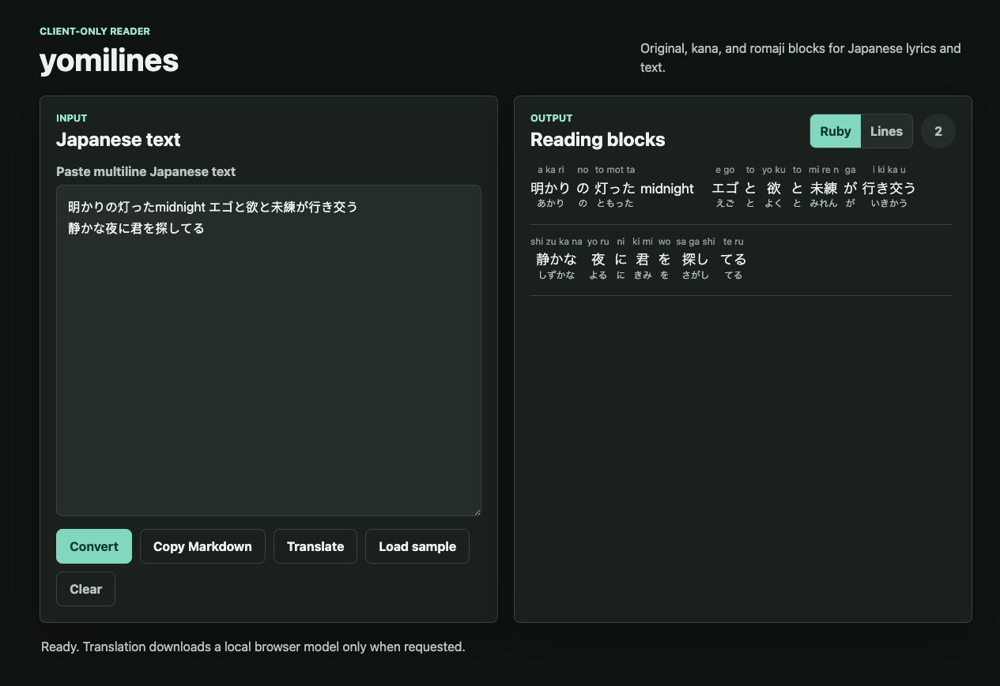
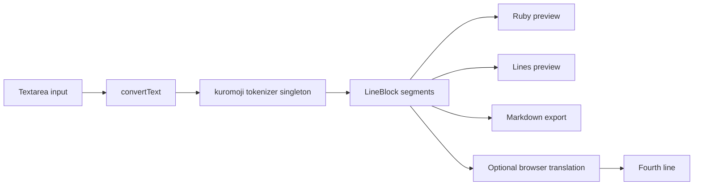
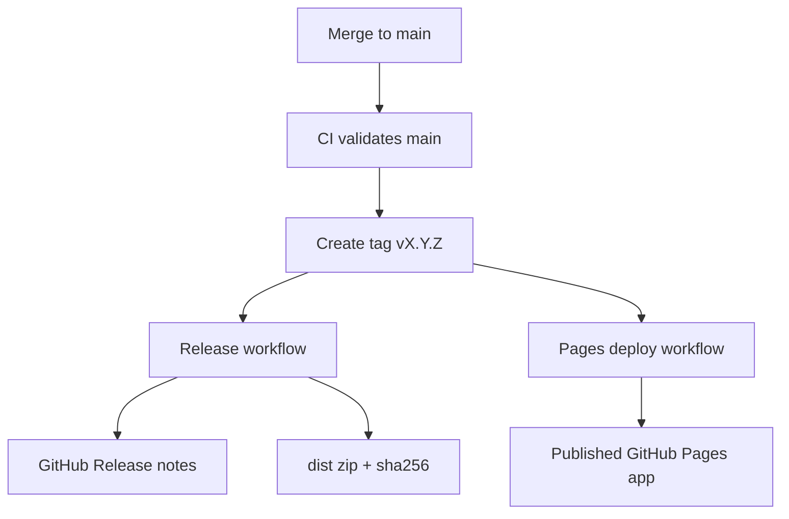

# yomilines

[](https://github.com/mussolene/yomilines/actions/workflows/ci.yml)
[](https://github.com/mussolene/yomilines/actions/workflows/deploy-pages.yml)
[](https://github.com/mussolene/yomilines/actions/workflows/release.yml)
[](https://mussolene.github.io/yomilines/)
[](LICENSE)
[](tsconfig.json)
[](package.json)

**Live app:** https://mussolene.github.io/yomilines/  
**Repository:** https://github.com/mussolene/yomilines

> EN: A client-only Japanese lyrics and text reader that converts pasted lines into original text, kana readings, romaji, and optional experimental English translation.  
> RU: Клиентское приложение для чтения японских текстов и лирики: вставляешь строки, получаешь оригинал, kana-чтение, romaji и опциональный экспериментальный перевод на английский.



## English

### What It Does

yomilines is a static GitHub Pages web app for reading Japanese lyrics and text. Paste multiline Japanese text and convert each non-empty line into a compact reading block.

```text
original line
kana reading line
romaji line
optional English translation
```

The default preview is ruby-style: each token is shown with small romaji above and kana below, while the copy output remains plain Markdown text.

### Features

- Japanese morphological analysis in the browser with `kuromoji`.
- Kana conversion and romaji generation with `wanakana`.
- Ruby-style preview with per-token readings.
- Classic three-line preview mode.
- Optional Japanese-to-English translation through a browser-loaded Transformers.js model.
- Copy output as Markdown/plain text.
- Static deployment to GitHub Pages.
- No backend, no accounts, no cookies, no tracking, no committed secrets.

### Limitations

- Readings depend on the bundled IPADIC dictionary used by `kuromoji`; names, ateji, slang, or stylized lyrics can be wrong.
- Romaji is derived from kana, not from a separate pronunciation model.
- Translation is experimental, Japanese-to-English only, and can miss lyric nuance.
- First translation use downloads a large public browser model, roughly 100+ MB depending on cache/runtime.
- Offline behavior depends on browser caching after assets and models have loaded.

## Русский

### Что Это

yomilines — статическое приложение для GitHub Pages, которое помогает читать японские тексты и песни. Вставляешь многострочный текст, а приложение превращает каждую непустую строку в блок чтения.

```text
оригинальная строка
строка чтения kana
строка romaji
опциональный перевод на английский
```

По умолчанию используется ruby-предпросмотр: над каждым токеном показывается маленькое romaji, под ним kana. Для копирования остается простой Markdown/plain text.

### Возможности

- Морфологический разбор японского в браузере через `kuromoji`.
- Конвертация kana и romaji через `wanakana`.
- Ruby-предпросмотр с чтением по токенам.
- Классический трехстрочный режим отображения.
- Опциональный перевод Japanese → English через модель Transformers.js в браузере.
- Копирование результата как Markdown/plain text.
- Деплой на GitHub Pages.
- Без backend, аккаунтов, cookies, трекинга и секретов в репозитории.

### Ограничения

- Чтения зависят от IPADIC-словаря `kuromoji`; имена, ateji, сленг и стилизованная лирика могут ошибаться.
- Romaji строится из kana, а не из отдельной pronunciation-модели.
- Перевод экспериментальный, только Japanese → English, и на песенных строках может промахиваться по смыслу.
- Первый запуск перевода скачивает большую публичную browser-модель, примерно 100+ MB с учетом кэша/runtime.
- Offline-режим зависит от того, успел ли браузер закэшировать assets и модель.

## Architecture / Архитектура



| Layer     | Files                 | Responsibility                                                         |
| --------- | --------------------- | ---------------------------------------------------------------------- |
| App shell | `src/App.tsx`         | State, actions, status, orchestration                                  |
| Domain    | `src/domain/*`        | Conversion, tokenizer, romaji, Markdown, translation, security helpers |
| UI        | `src/components/*`    | Presentation-only React components                                     |
| Styles    | `src/styles.css`      | Responsive Material-inspired custom CSS                                |
| CI/CD     | `.github/workflows/*` | Validation, tag releases, GitHub Pages deploy                          |

## Release Cycle / Цикл Релиза



Releases and production deploys are tag-driven.

1. Update code and merge/push to `main`.
2. Run local checks:

```bash
npm run lint
npm run typecheck
npm run test
npm run build
```

3. Create and push a version tag:

```bash
git tag v0.2.0
git push origin v0.2.0
```

4. GitHub Actions will:

- run validation,
- build the static app,
- publish GitHub Pages from the tag,
- create a GitHub Release,
- attach `yomilines-vX.Y.Z-dist.zip`,
- attach `yomilines-vX.Y.Z-dist.zip.sha256`.

Manual Pages deploy is still available through the `Deploy GitHub Pages` workflow.

## Security Model / Модель Безопасности

All user input is treated as untrusted text. The app renders React text nodes only, avoids `dangerouslySetInnerHTML`, does not use application-level `eval` or `new Function`, and has no inline event handlers. Clipboard writes use plain text.

The optional translation feature uses `@xenova/transformers` and ONNX Runtime Web. It does not use API keys or secrets, but it downloads a public model from Hugging Face when the user clicks Translate. If you deploy a strict CSP, test translation carefully because ONNX Runtime builds may require eval-like WebAssembly/bootstrap behavior.

CSRF is not applicable in v1 because there is no authentication, cookies, sessions, or state-changing backend.

Recommended strict CSP for the core reader without translation:

```http
Content-Security-Policy: default-src 'self'; script-src 'self'; style-src 'self' 'unsafe-inline'; img-src 'self' data:; font-src 'self'; connect-src 'self'; object-src 'none'; base-uri 'self'; frame-ancestors 'none'; form-action 'none';
```

For experimental translation, `connect-src` must allow `https://huggingface.co` unless the model files are self-hosted. Depending on runtime behavior, `script-src 'unsafe-eval'` may also be required; treat that as a deliberate tradeoff.

## Accessibility / Доступность

- Semantic regions, labels, and status messages.
- Keyboard-accessible controls with visible focus states.
- Touch targets sized at least 44px.
- Contrast-oriented light and dark CSS variables.
- Status is conveyed with text, not color alone.

## Development / Разработка

```bash
npm install
npm run dev
npm run test
npm run build
```

Other commands:

```bash
npm run lint
npm run typecheck
npm run test:watch
npm run format
npm run format:check
npm run preview
```

## Deployment / Деплой

Vite is configured for repository Pages deployment:

```ts
base: process.env.GITHUB_PAGES === 'true' ? '/yomilines/' : '/';
```

If the repository is renamed, update `/yomilines/` in `vite.config.ts`.

GitHub Pages should use **Settings → Pages → Build and deployment → Source → GitHub Actions**.

## Contributing / Контрибьютинг

- Keep the core reader client-only and deterministic.
- Keep domain logic in `src/domain`.
- Add tests for conversion, Markdown, security, and UI behavior when changing behavior.
- Run `npm run lint`, `npm run typecheck`, `npm run test`, and `npm run build` before releasing.
